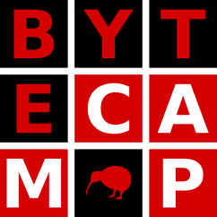

Overview
========

**ByteCamp** is my personal software collection of small projects,
where I set myself small tasks to demonstrate simple applications or
programs using a broad array of technologies.

Projects
========

The following are the projects I have recently undertaken.

* `RepoScraper <https://gitlab.com/bytecamp/github-scraper>`_ (First release: 26/09/2023)

Contact
=======

For any questions or feedback, reach out to me via my email:
elliot@p-s.co.nz
